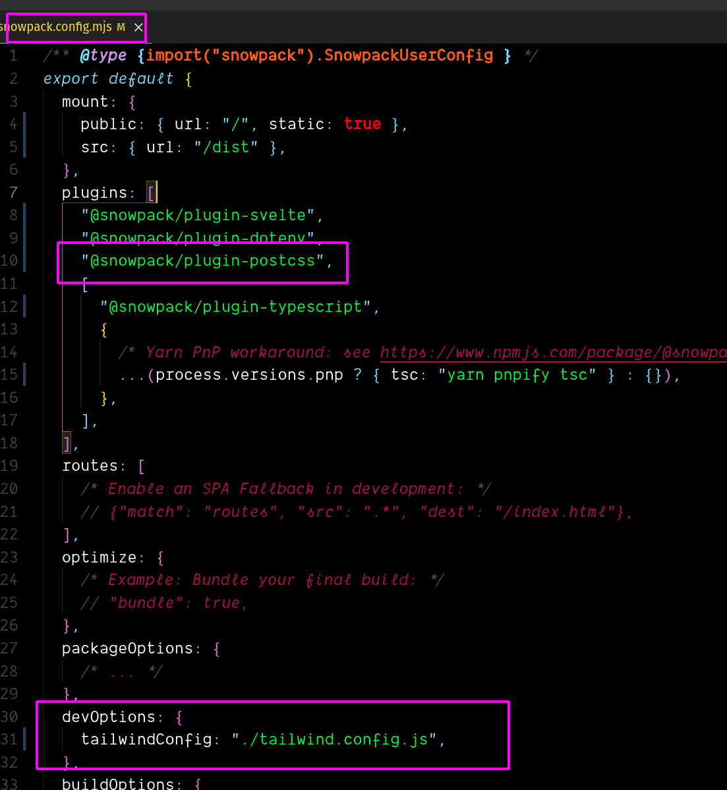
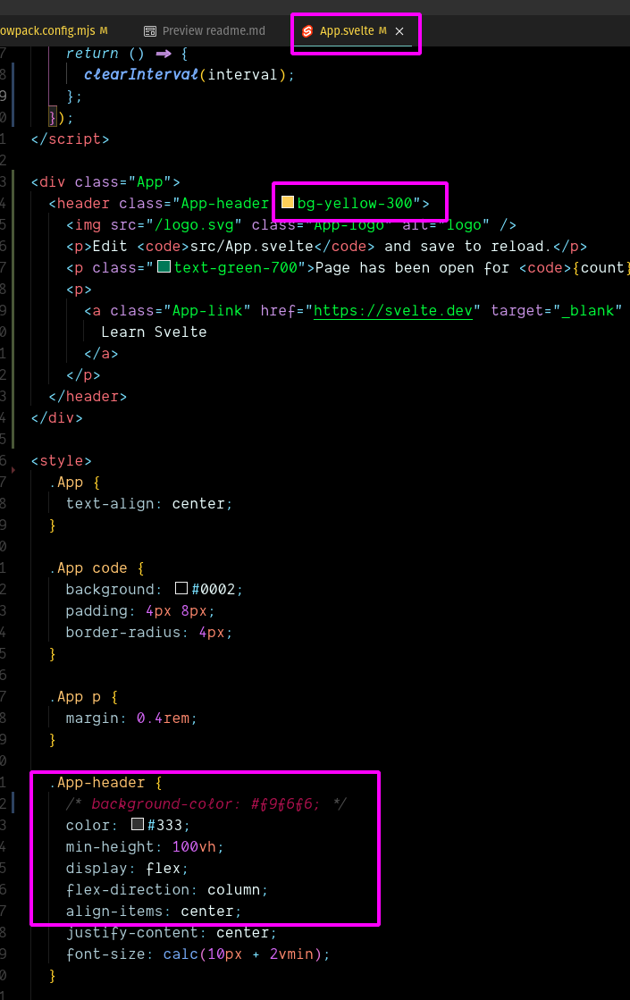
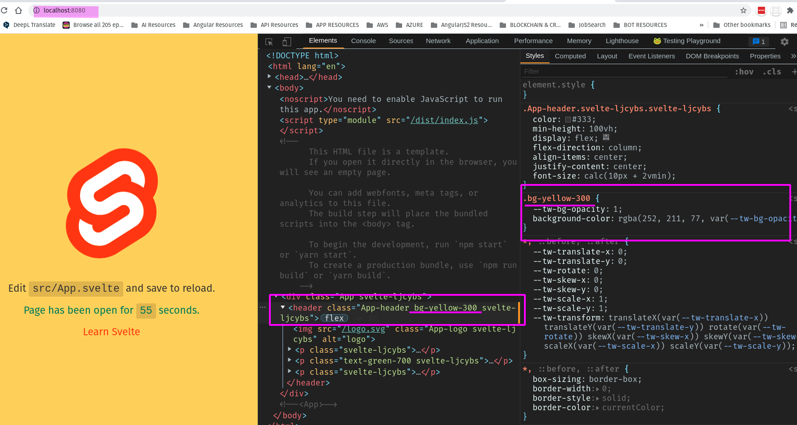

# Guide to configure a Svelte application with [snowpack](https://www.snowpack.dev/)

What we want to accomplish?
A functional [Svelte](https://svelte.dev/) web app, capable of handling Typescript, and [TailwindCSS](https://tailwindcss.com/) ready

The problem?

As exciting as today's web tools are, as performing and unstoppable in innovations are,  
they are also a complex ballet; a moving target, so the idea here is to try to establish  
a quick guide on how to set up your Svelte application with snowpack.

What we'll do

A step by step guide from empty directory to fully configured Snowpack project handling  
the Svelte framework capable of handling Typescript and ready for styling  
with the TailwindCSS framework

## Create the Snowpack App

The easiest way is to start a new Snowpack project with [Create Snowpack App](https://github.com/snowpackjs/snowpack/tree/main/create-snowpack-app/cli), a tool for  
creating a new project based on templates.

Create Svelte App name `svelte-snowpack-typescript-tailwind` using an official template  
for more info check [snowpack-svelte tutorial](https://www.snowpack.dev/tutorials/svelte)

```bash
npx create-snowpack-app svelte-snowpack-typescript-tailwind --template @snowpack/app-template-svelte-typescript
```

change directory to:

```bash
cd svelte-snowpack-typescript-tailwind
npm run start
```

That was easy!
Now you have a full Svelte App capable of handling logic in Typescript instead of Javascript  
running on port 8080

## Set TaiwindCSS as the styling framework of choice

First we need Postcss

Install dependencies

```bash
npm install --save-dev tailwindcss @snowpack/plugin-postcss postcss autoprefixer cssnano
```

then configure files: `postcss.config.js` & `tailwind.config.js` at project root

- this files use the Node style require instead of esm import

At `postcss.config.js` :

```javascript
const tailwind = require("tailwindcss");
const autoprefixer = require("autoprefixer");
const cssnano = require("cssnano");

const plugins =
  process.env.NODE_ENV === "production" ? [tailwind, autoprefixer, cssnano] : [tailwind, autoprefixer];

module.exports = { plugins };
```

Then go to `tailwind.config.js`

```javascript
// tailwind.config.js
module.exports = {
  mode: "jit",
  purge: ["./public/**/*.html", "./src/**/*.svelte"],
  // specify other options here
};
```

Let know `snowpack` you want to use `posttcss` preprocessor
At `snowpack.config.mjs`



Cool! last steps

create file: `src/main.css` and paste the basic config of TailwindCSS

```css
@tailwind base;

@tailwind components;

@tailwind utilities;
```

Then at `src/index.ts` import

```typescript
import App from "./App.svelte";
import "./main.css";
```

Test if this Works!!!

At `src/App.svelte` set the background to a typical tailwindcss utility class



result


